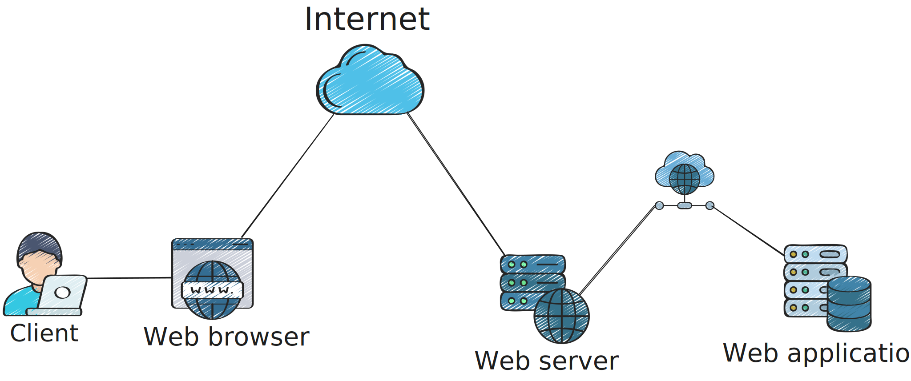
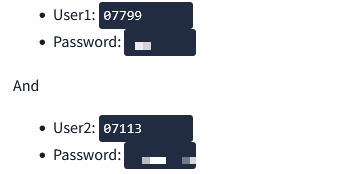
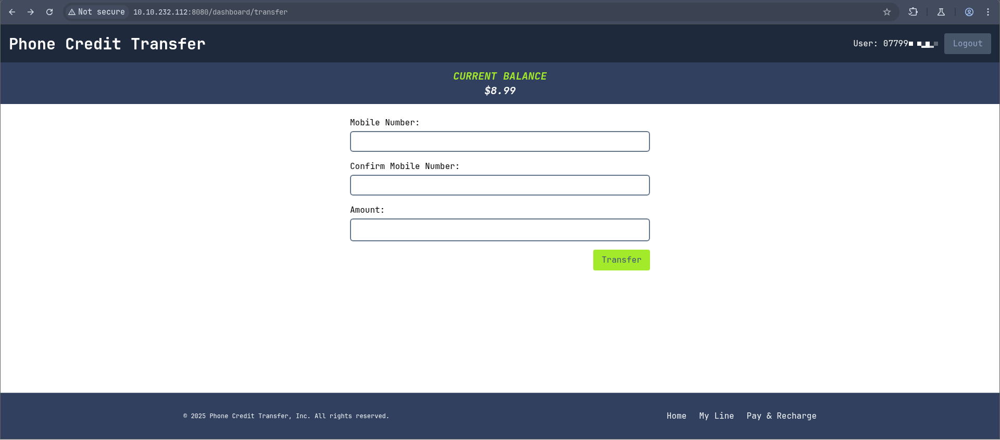
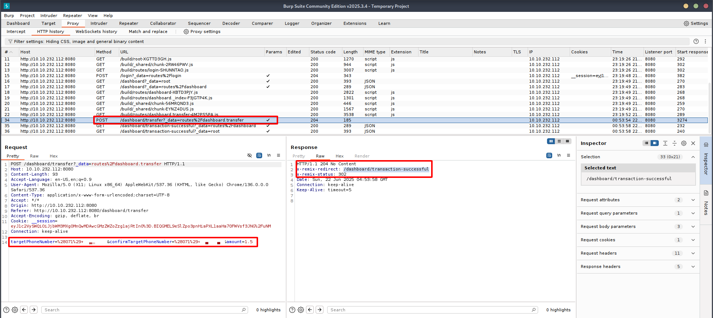
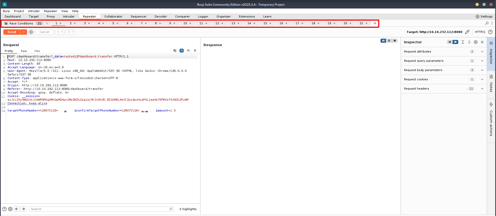
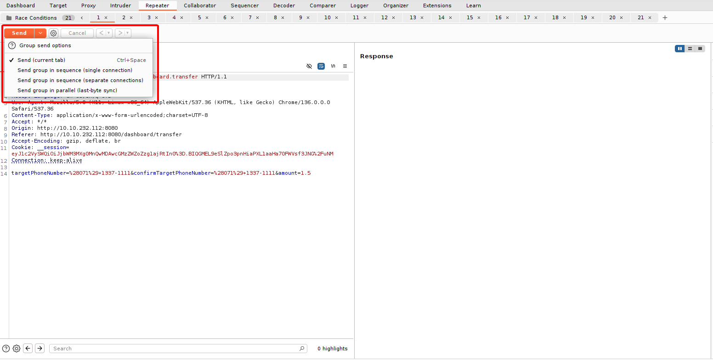
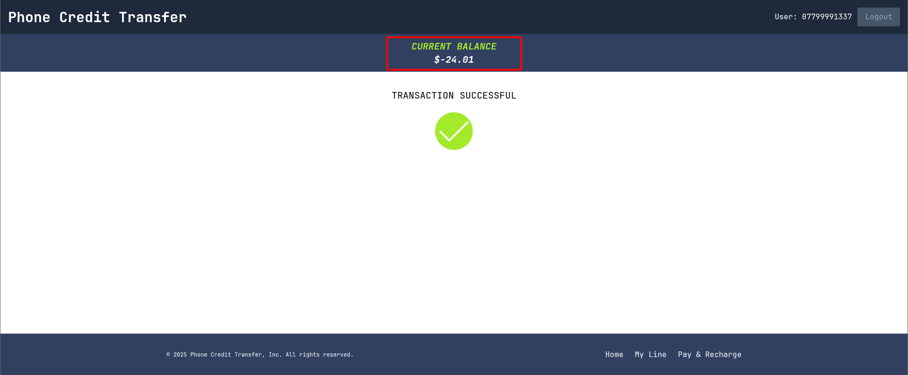
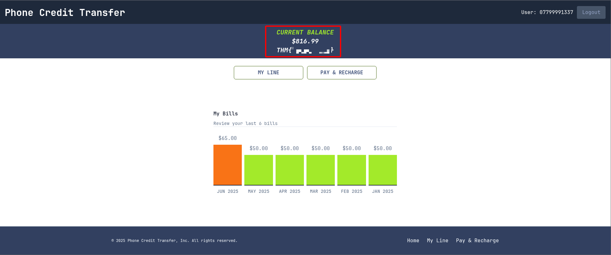

:::note[THÔNG TIN]
Bài viết này ghi chú lại quá trình mình học từ [Room: Race Conditions](https://tryhackme.com/room/raceconditionsattacks) trên **TryHackMe**.
:::

## Tóm tắt

Đã bao giờ bạn nghĩ đến chuyện: nếu tài khoản ngân hàng bạn chỉ còn 100.000đ, nhưng bạn thực hiện hai lần rút 100.000đ **gần như đồng thời**, thì có thể bạn sẽ rút được **200.000đ**, mặc dù bạn không có đủ tiền?

Đó chính là ví dụ điển hình của **Race Condition** — khi hai thao tác xảy ra đồng thời và vượt qua kiểm tra logic do hệ thống xử lý không kịp.

Trong phần này, mình sẽ tìm hiểu về lỗ hổng **Race Conditions**, khai thác nó bằng công cụ **Burp Suite Repeater**, và đồng thời làm rõ một vài khái niệm liên quan như **program**, **process**,**threads** và **multi-threading**.

## Một số khái niệm cần làm rõ

### Programs

Một **program** (chương trình) là tập hợp các câu lệnh được viết ra để thực hiện một công việc cụ thể.

**Tuy nhiên:**
- Khi bạn chỉ viết ra chương trình → nó chưa làm gì cả.
- Bạn phải thực thi (*execute*) thì chương trình mới hoạt động và tạo ra kết quả.

### Processes

Một **process** (tiến trình) là **program đang được thực thi**.

Một process bao gồm:
- **Program:** Mã nguồn đang chạy (ví dụ: file `.py`)
- **Memory:** Vùng nhớ tạm thời như biến, stack, heap,...
- **State:** Trạng thái hiện tại của tiến trình

Các trạng thái chính:
- **New:** Vừa được tạo
- **Ready:** Sẵn sàng chạy, chờ CPU cấp thời gian
- **Running:** Đang được CPU xử lý
- **Waiting:** Đang chờ I/O hoặc sự kiện
- **Terminated:** Đã hoàn tất

### Threads

**Thread** là một đơn vị thực thi nhẹ (*lightweight*) bên trong một process.

Hình dung đơn giản:
- **Process** như một **quán cà phê**
- **Thread** như **nhân viên** phục vụ trong quán

**Ví dụ:**  
Một khách đặt 6 ly cà phê. Nếu quán chỉ có 1 nhân viên (1 thread), mỗi ly mất 30 giây → đơn hàng hoàn tất sau 3 phút.  
Nhưng nếu có 6 nhân viên (multi-threading), mỗi người làm 1 ly cùng lúc → đơn chỉ mất 30 giây.

=> Threads giúp **xử lý công việc song song**, tăng hiệu quả, giảm thời gian chờ.

## Lỗ hổng Race Conditions

Như đã nêu ở [đầu bài viết](#tóm-tắt), mỗi khi người dùng rút tiền, chương trình sẽ tạo một **thread** để xử lý yêu cầu đó.  
Vậy chuyện gì sẽ xảy ra nếu **hai thread cùng lúc thực hiện việc rút tiền vượt quá số dư tài khoản?**  
→ Đó chính là **Race Condition**.

### Vấn đề nằm ở đâu?

Race Condition xảy ra khi **nhiều luồng (threads) cùng truy cập và chỉnh sửa một vùng dữ liệu chia sẻ**, nhưng **không được đồng bộ đúng cách**.

> ❗ Các thread này có thể can thiệp vào nhau gây ra trạng thái không mong muốn, lỗi logic, hoặc làm rò rỉ dữ liệu.

### Một số nguyên nhân phổ biến gây Race Condition:

#### 1. **Thực thi song song (Parallel Execution)**  
Các web server thường xử lý nhiều yêu cầu người dùng đồng thời. Nếu những yêu cầu này cùng đọc/ghi vào một tài nguyên dùng chung (như biến toàn cục hoặc trạng thái phiên) mà **không có cơ chế đồng bộ**, thì race condition rất dễ xảy ra.

#### 2. **Tác động đến cơ sở dữ liệu (Database Operations)**  
Ví dụ: hai người cùng lúc update số dư của một tài khoản. Nếu không dùng các cơ chế như **lock, transaction isolation**, thì dữ liệu có thể bị sai lệch hoặc ghi đè lên nhau.

#### 3. **Thư viện/Service bên thứ ba**  
Một số thư viện hoặc API không được thiết kế để xử lý nhiều request đồng thời. Nếu nhiều thread hoặc tiến trình gọi cùng lúc, race condition có thể xảy ra từ chính các thành phần bên ngoài.

### 📌 Kết luận

> **Race Condition** là một lỗi logic nguy hiểm và thường khó phát hiện, vì nó chỉ xảy ra khi các thread thực thi đúng “thời điểm xấu”.  
Để phòng tránh, cần hiểu rõ cách luồng và tài nguyên được chia sẻ, đồng thời sử dụng các kỹ thuật như **mutex, lock, atomic operation, transaction isolation**, v.v.

## Kiến trúc ứng dụng web

### Mô hình Client–Server

Hiểu đơn giản, mô hình này gồm hai thành phần:
- **Client (máy khách):** Gửi yêu cầu (*request*) đến
- **Server (máy chủ):** Nhận yêu cầu, xử lý và phản hồi lại kết quả (*response*)

### Kiến trúc đa tầng (Multi-tier Architecture)

Ứng dụng web hiện đại thường được xây dựng theo **kiến trúc đa tầng**, chia thành nhiều lớp (layers) để **phân tách trách nhiệm** và **dễ bảo trì, mở rộng**.

Cấu trúc phổ biến nhất là **3-tier (3 tầng):**

#### 1. Presentation Tier (Tầng trình bày)
- Là phần người dùng tương tác trực tiếp: **trình duyệt web**.
- Trình duyệt sẽ tải các file HTML, CSS, JS và hiển thị giao diện cho người dùng.

#### 2. Application Tier (Tầng logic ứng dụng)
- Xử lý **logic nghiệp vụ** của ứng dụng.
- Khi client gửi request, tầng này tiếp nhận và xử lý, có thể gọi đến tầng dữ liệu nếu cần.
- Được xây dựng bằng các ngôn ngữ lập trình phía server như:
  - **Java (Spring Boot)**
  - **Python (Flask, Django)**
  - **JavaScript (Node.js)**
  - ...

#### 3. Data Tier (Tầng dữ liệu)
- Phụ trách **lưu trữ và truy vấn dữ liệu**.
- Giao tiếp thông qua hệ quản trị cơ sở dữ liệu (**DBMS**) như:
  - MySQL
  - PostgreSQL
  - MongoDB
  - ...

> 👉 Ngoài CRUD (Create, Read, Update, Delete), tầng này còn xử lý các truy vấn phức tạp hơn như lọc dữ liệu, thống kê, phân trang,...

## Khai thác lỗ hổng Race Conditions

Trong phần này, mình được cung cấp hai tài khoản người dùng như sau:

Sau khi đăng nhập, mục tiêu là khai thác chức năng **Pay & Recharge**.

Mình sẽ thử chuyển tiền từ `user1` sang `user2`.

Như hình trên, mình dùng **Burp Suite** để theo dõi quá trình xử lý request. Khi chuyển tiền thành công, server sẽ phản hồi bằng status `204 No Content` và redirect người dùng về trang `/dashboard/transaction-successful`.

Tiếp theo, mình chuyển request này sang tab **Repeater**, tạo một group request và nhân bản nhiều lần để thử khai thác race condition.

### Trước khi gửi group, mình sẽ giải thích sơ qua về 3 cách gửi:

- **Send group in sequence (single connection)**  
  Gửi các request **tuần tự** trên **cùng một kết nối TCP**.

- **Send group in sequence (separate connections)**  
  Gửi các request **tuần tự**, **mỗi request dùng một kết nối TCP riêng**.

- **Send group in parallel (last-byte sync)**  
  Gửi tất cả các request **song song cùng lúc** – cách phổ biến nhất để khai thác race condition.

Mình chọn cách **Send group in parallel**. Tất cả các request đều trả về thành công. Khi reload lại trang, mình thấy kết quả như sau:

Số dư của tài khoản `user1` đã âm **25.01$**, nghĩa là mình đã chuyển số tiền vượt quá số dư thật sự – dấu hiệu rõ ràng của **Race Condition**.

### Câu hỏi từ TryHackMe:

> You need to get either of the accounts to get more than $100 of credit to get the flag. What is the flag that you obtained?

Vì `user1` đã bị âm tiền, không thể dùng để tiếp tục khai thác được nữa. Do đó, mình chuyển sang đăng nhập tài khoản `user2` và thực hiện tương tự các bước trước, lần này cố gắng để tài khoản **vượt mốc $100** chỉ trong một lần gửi group.

Khi số dư đạt đủ, hệ thống sẽ cấp flag như thế này

## Phát hiện và phòng tránh

### Làm thế nào để phát hiện?

Việc phát hiện Race Condition là một thử thách lớn vì hành vi khai thác thường **rất tinh vi và khó lặp lại chính xác**.

Ví dụ: Nếu một người dùng **sử dụng lại một voucher nhiều lần**, mà không ai kiểm tra log hoặc thống kê bất thường, thì rất có thể hành vi đó **sẽ không bị phát hiện**.

Do đó, vai trò của **pentester và bug bounty hunter** rất quan trọng – họ hiểu rõ hệ thống, xác định các giới hạn, và kiểm tra các hành vi bất thường.

Các bước phát hiện thường bao gồm:

- Xác định **quy tắc kiểm soát** (ví dụ: vote một lần, chỉ rút khi đủ tiền,...)
- Thử tìm cách **vượt qua giới hạn** bằng cách gửi nhiều request đồng thời
- Phân tích **trạng thái hệ thống (state)** để xác định các "khoảnh khắc nguy hiểm"
- Sử dụng công cụ như **Burp Suite Repeater** hoặc các công cụ tương đương để tạo điều kiện race

---

### Vậy làm thế nào để phòng tránh?

#### **Cơ chế đồng bộ (Synchronization Mechanisms)**

Các ngôn ngữ lập trình hiện đại hỗ trợ **cơ chế khóa (lock)**. Khi một tiến trình đã lock một tài nguyên (ví dụ như một biến, một tài khoản...), các tiến trình khác **phải đợi đến khi tài nguyên được mở khóa** mới được truy cập tiếp.

> Điều này đảm bảo rằng **không có hai tiến trình truy cập và sửa cùng một tài nguyên tại cùng thời điểm**.

---

#### **Thao tác nguyên tử (Atomic Operations)**

Một thao tác nguyên tử là thao tác **không thể bị chia nhỏ hay gián đoạn**. Khi một tiến trình bắt đầu thực hiện, **không tiến trình nào khác có thể chen ngang giữa chừng**.

> Ví dụ: Một quy trình rút tiền gồm:
> 
> - Kiểm tra số dư  
> - Trừ tiền  
> - In biên lai  
> - Ghi log  
>
> Nếu quy trình này **không nguyên tử**, thì một thread khác có thể chen vào giữa các bước → gây lỗi.

---

#### **Giao dịch cơ sở dữ liệu (Database Transactions)**

Một transaction (giao dịch) nhóm nhiều thao tác lại thành **một khối thống nhất**. Toàn bộ thao tác **hoặc thành công hết, hoặc thất bại hết**.

> Ví dụ: Khi chuyển tiền:
>
> - Trừ tiền ở người gửi  
> - Cộng tiền cho người nhận  
>
> Nếu bước cộng tiền thất bại, thì hệ thống sẽ **roll back**, tức là **không trừ tiền luôn**, đảm bảo dữ liệu nhất quán.

---

**🔎 Xem thêm:** [Các bài viết về Race Conditions](/archive/?tag=race-conditions)